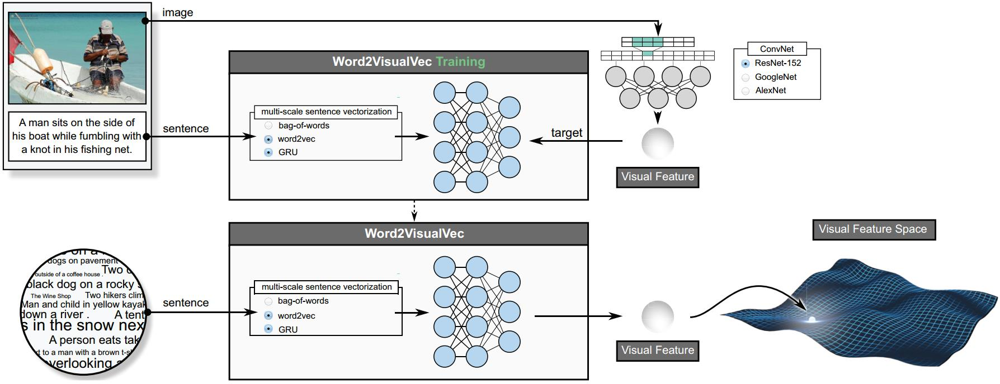
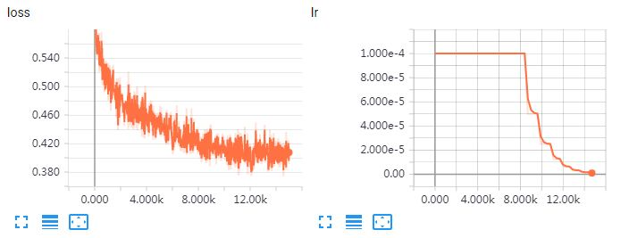

# Word2VisualVec

This package is a python implementation of image caption retrieval using Word2VisualVec. [Word2VisualVec](https://ieeexplore.ieee.org/document/8353472/) is a deep neural network architecture that learns to predict a deep visual feature of textual input based on multi-scale sentence vectorization and a multi-layer perceptron, which has been already successfully used in image(video) caption retrieval [1] and video captioning [2]. Moreover, it is also our winning solution for Matching and Ranking subtask of Video to Text Description in TRECVID 2016 [3].

**Note a better video-text matching model is available [here](https://github.com/danieljf24/dual_encoding).**



## Requirements

#### Required Packages
* **python** 2.7
* **TensorFlow** 1.7 
* **keras** 2.1.6 with TensorFlow backend
* **pydot** for keras visualization
* **tensorboard_logger** for tensorboard visualization

We used virtualenv to setup a deep learning workspace that supports keras with TensorFlow backend.
Run the following script to install the required packages.
```shell
virtualenv --system-site-packages ~/w2vv
source ~/w2vv/bin/activate
pip install --upgrade pip
pip install --upgrade tensorflow
pip install keras
pip install tensorboard_logger
pip install pydot
deactivate
```

#### Required Data
Run `do_get_dataset.sh` or the following script to download and extract flickr8k(58M), flickr30k(230M) dataset and a pre-trained word2vec(3.0G).
The data can also be downloaded from [Google Drive](https://drive.google.com/open?id=1AgFzl7OvfmEQAOYzdbNbbL2r9ox6TpJA) and [Baidu Pan](https://pan.baidu.com/s/1aoGDxmEUH6XRSigQ64KFTA).
The extracted data is placed in `$HOME/VisualSearch/`.
```shell
ROOTPATH=$HOME/VisualSearch
mkdir -p $ROOTPATH && cd $ROOTPATH

# download and extract dataset
wget http://lixirong.net/data/w2vv-tmm2018/flickr8k.tar.gz
tar zxf flickr8k.tar.gz

wget http://lixirong.net/data/w2vv-tmm2018/flickr30k.tar.gz
tar zxf flickr30k.tar.gz

# download and extract pre-trained word2vec
wget http://lixirong.net/data/w2vv-tmm2018/word2vec.tar.gz
tar zxf word2vec.tar.gz
```


## Getting started
Run the following script to train and evaluate the Word2VisualVec on flickr8k and flickr30k.
```shell
source ~/w2vv/bin/activate
# on flickr8k
./do_all.sh flickr8kenctrain flickr8kencval flickr8kenctest
# on flickr30k
./do_all.sh flickr30kenctrain flickr30kencval flickr30kenctest
deactive
```
Running the script will do the following things:
1. Generate a dictionary on the training set.
2. Train the Word2VisualVec and select a checkpoint that performs best on the validation set as the final model. Notice that we only save the best-performing checkpoint on the validation set to save disk space.
3. Evaluate the final model on the test set.

## Visualization

During the training, run the following script to start a tensorboard sever and open a browser to visualize some important parameters, such as loss and learning rate. (Notice that the file `do_visual.sh` will be automatically generated when the training process starts. )
```shell
source ~/w2vv/bin/activate
./do_visual.sh 10101 #port id
# open a brower and enter the url: http://127.0.1.1:10101
deactive
```
A tensorboard visualization example:



## Expected Performance
The performance of Word2VisualVec on flickr8k and flickr30k is as follows, with the code run on a Ubuntu 16.04 machine with CUDA 9.0. Notice that due to random factors in SGD based training,  the numbers differ slightly from those reported in the paper (see Table 1).

| Dataset | R@1 | R@5 | R@10 | Mean r |	Med r |
| ------------- | ------------- | ------------- | ------------- |  ------------- | ------------- |
| flickr8k | 37.6 | 66.4 | 77.8 | 3.0 | 13.2 |
| flickr30k | 45.6 | 72.1 | 81.5 | 2.0 | 13.3 |


## How to train Word2VisualVec on other datasets?

Store the training, validation and test subset into three folders in the following structure respectively.
```shell
${subset_name}
├── FeatureData
│   └── ${feature_name}
│       ├── feature.bin
│       ├── shape.txt
│       └── id.txt
├── ImageSets
│   └── ${subset_name}.txt
└── TextData
    └── ${subset_name}.caption.txt

```

* `FeatureData`: image features. Using [txt2bin.py](simpleknn/txt2bin.py) to convert image feature in the required binary format.
* `${subset_name}.txt`: all image IDs in the specific subset, one image ID per line.
* `${dsubset_name}.caption.txt`: caption data. The file structure is as follows, in which the image and sent in the same line are relevant.
```
image_id_1#1 sentence_1
image_id_1#2 sentence_2
...
image_id_n#1 sentence_k
...
```

When the data is ready, use the following script to train and evaluate Word2VisualVec on your own dataset.
```shell
source ~/w2vv/bin/activate
./do_all_own_data.sh ${train_set_name} ${val_set_name} ${test_set_name} --img_feature=${feature_name} --n_caption=${caption_num}
deactive
```
where `train_set_name`, `val_set_name` and `test_set_name` indicate the name of traning, validation and test set, respectively. Besides, `feature_name` is the visual feature name and `caption_num` denotes the number of captions for each image. For flickr8k and flickr30 datasets, the value of `caption_num` is 5. 

## How to use a pre-trained Word2VisualVec?
Word2VisualVec essentially generates a dense representation of a given sentence.
[This note](w2vv_representation.ipynb) shows
* How to load a trained Word2VisualVec model?
* How to predict visual features from a new sentence?


## References
1. Jianfeng Dong, Xirong Li and Cees G. M. Snoek. [Predicting Visual Features from Text for Image and Video Caption Retrieval](https://ieeexplore.ieee.org/document/8353472/). IEEE Transactions on Multimedia, 2018.
2. Jianfeng Dong, Xirong Li, Weiyu Lan, Yujia Huo, and Cees G. M. Snoek. [Early Embedding and Late Reranking for Video Captioning](http://dl.acm.org/citation.cfm?id=2984064). ACM Multimedia, 2016 (Grand Challenge Award Paper).
3. Cees G. M. Snoek, Jianfeng Dong, Xirong Li, Xiaoxu Wang, Qijie Wei, Weiyu Lan, Efstratios Gavves, Noureldien Hussein, Dennis C. Koelma, Arnold W. M. Smeulders. [University of Amsterdam and Renmin University at TRECVID 2016: Searching Video, Detecting Events and Describing Video](https://www-nlpir.nist.gov/projects/tvpubs/tv16.papers/mediamill.pdf). TRECVID Workshop, 2016.
